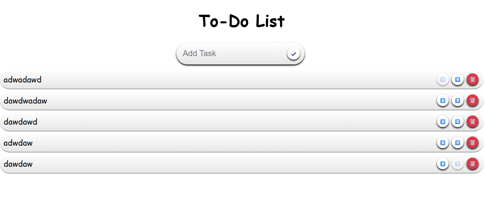

# React To-Do List

A simple and responsive React-based To-Do List application. Users can add, and delete tasks — all managed through React’s component and state system.

---

## Features

- Add and delete tasks
- Set a task's priority
- Fully responsive and aesthetic UI
- Built using modern React fundamentals

---

## Built With

- **React** (Vite)
- **JavaScript (ES6+)**
- **HTML5**
- **CSS3**

---

## Screenshot

  

---

## [Live Preview](https://react-todo-o5cf0ep20-aeshans-projects-5582dde3.vercel.app/)

---

Made with purpose by [@derarshan](https://github.com/derarshan)  
ChagaChagaChagaChaga
